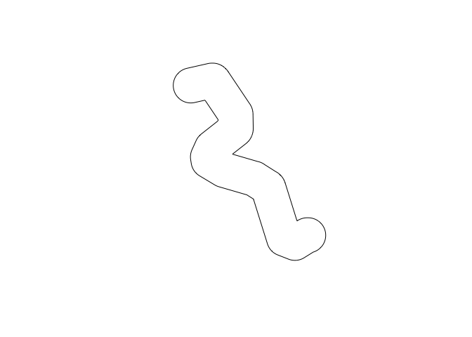
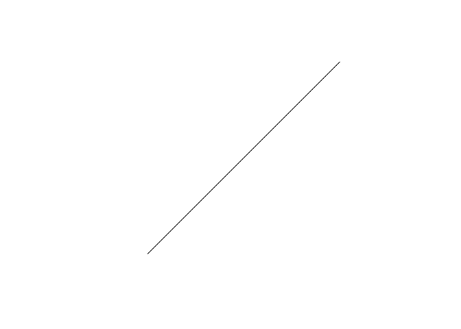
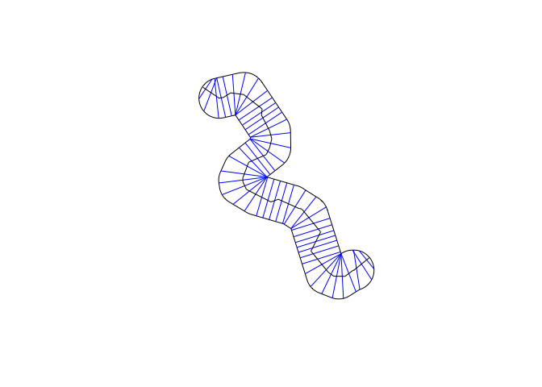
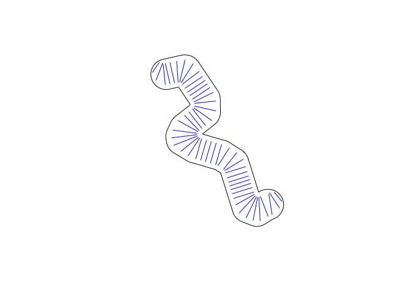
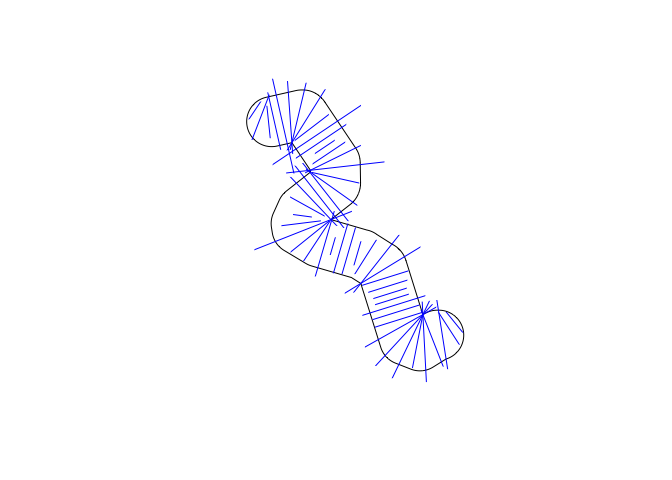

<!-- README.md is generated from README.Rmd. Please edit that file -->

# sxchan: simple cross section channels features

<!-- badges: start -->

[](https://github.com/stochaGBEM/sxchan/actions/workflows/R-CMD-check.yaml)
[](https://app.codecov.io/gh/stochaGBEM/sxchan?branch=main)
<!-- badges: end -->

The purpose of sxchan is to create and manipulate watercourse
geometries, particularly cross sections. Because this package sits on
top of the sf package, geometries can also be manipulated in the same
way as in the sf package.

The name of the package is inspired by the sf package. Functions in
sxchan start with a common prefix, `xt`, which stands for “cross-section
type”; this is intended to parallel the sf package’s function prefix,
`st`, which stands for “spatial type”.

## Installation

You can install the development version of sxchan from
[GitHub](https://github.com/) with:

``` r
# install.packages("devtools")
devtools::install_github("stochaGBEM/sxchan")
```

## Example

``` r
library(sxchan)
library(sf)
#> Linking to GEOS 3.11.0, GDAL 3.5.3, PROJ 9.1.0; sf_use_s2() is TRUE
```

### Constructing cross section objects

Cross section objects can be made using the function `xt_sxc()`, where
“sxc” stands for “spatial cross-section column”.

1.  Simply specify cross section width if you’re not interested in the
    spatial arrangement of the cross sections:

``` r
cross1 <- xt_sxc(c(8, 7, 5, 6, 5, 8))
plot(cross1)
```



2.  Or, you can turn a series of line segments into a cross section
    object. This time, set a coordinate reference system, too:

``` r
seg <- st_linestring(matrix(c(0, 1, 0, 1), ncol = 2))
cross2 <- xt_sxc(seg)
plot(cross2)
```



Retrieve widths:

``` r
xt_width(cross1)
#> [1] 8 7 5 6 5 8
```

``` r
xt_width(cross2)
#> [1] 1.414214
```

Because these cross sections are just `sfc` objects from the sf package,
you can add features by making it an `sf` object:

``` r
# st_sf(cross1, swimmability = c(5, 4, 3, 2, 1, 0), roughness = 0.01)
```

### Generating geometries from bankline polygon

sxchan has a built-in demo bankline polygon:

``` r
plot(demo_bankline)
```


You can generate cross sections and a centerline:

``` r
demo_cross <- xt_generate_sxc(demo_bankline, n = 50)
demo_center <- xt_generate_centerline(demo_bankline)
plot(demo_bankline)
plot(demo_cross, add = TRUE, col = "blue")
plot(demo_center, add = TRUE)
```



You can widen the cross sections, either by a constant amount or one per
cross section:

``` r
plot(demo_bankline)
xt_widen_times(demo_cross, times = 0.7) |> 
  plot(add = TRUE, col = "blue")
```



``` r
set.seed(1)
plot(demo_bankline)
xt_widen_times(demo_cross, times = exp(rnorm(50) / 2)) |> 
  plot(add = TRUE, col = "blue")
```


