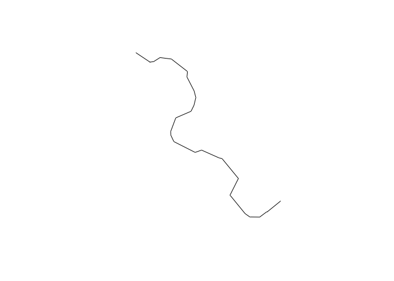

<!-- README.md is generated from README.Rmd. Please edit that file -->

# sxchan

<!-- badges: start -->

[](https://github.com/stochaGBEM/sxchan/actions/workflows/R-CMD-check.yaml)
[](https://app.codecov.io/gh/stochaGBEM/sxchan?branch=main)
<!-- badges: end -->

Simple x-section channel features.

## Installation

You can install the development version of sxchan from
[GitHub](https://github.com/) with:

``` r
# install.packages("devtools")
devtools::install_github("stochaGBEM/sxchan")
```

## Example

``` r
library(sxchan)
```

Here is an example of a bankline polygon:

``` r
# plot(my_banks)
```

It’s an sf polygon object:

``` r
class(my_banks)
#> [1] "sfc_POLYGON" "sfc"
```

Start a channel object containing the banks.

``` r
ch <- channel(my_banks)
```

Get centerline:

``` r
sx_centerline(ch) |> 
  plot()
```


